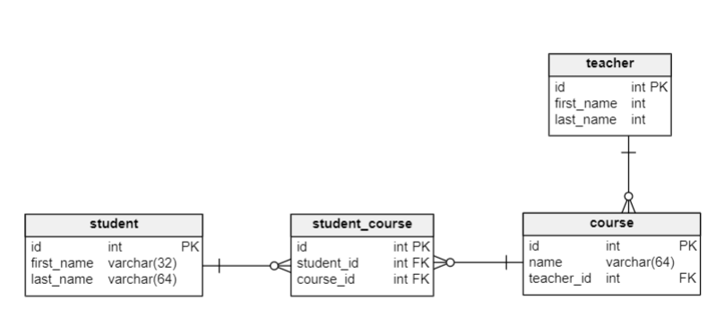
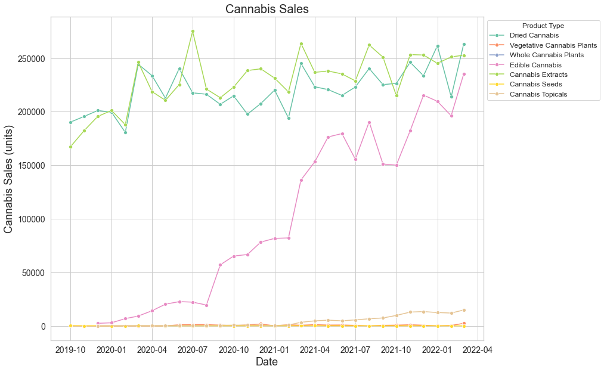
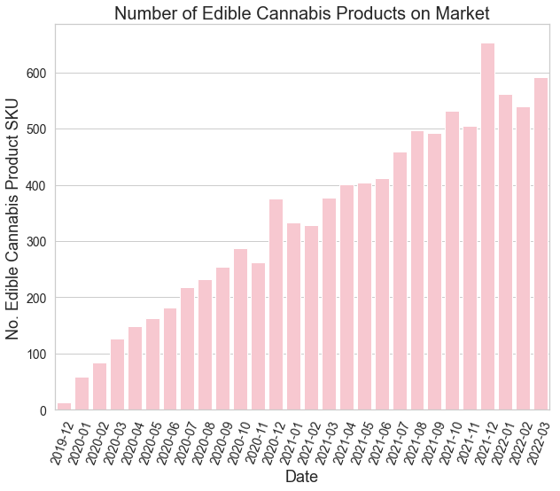

<div id="top"></div>

<!-- PROJECT LOGO -->
<br />
<div align="center">
<h1 align="center">Neobi Interview Questions</h1>
  <p align="center">
    Quality Assurance Data Analyst Position
    <br />
    <a href="https://github.com/HalleypC/Neobi-Questions/blob/main/Q1.ipynb">Q1</a>
    ·
    <a href="https://github.com/HalleypC/Neobi-Questions/blob/main/Q2.ipynb">Q2</a>
    ·
    <a href="https://github.com/HalleypC/Neobi-Questions/blob/main/Q3.ipynb">Q3</a>
  </p>
</div>

## 1. Write a query to Join three tables in SQL



Using the above Database as an example, here is how we can join three tables using SQL:

```SQL
        SELECT
          student.first_name,
          student.last_name,
          course.name
        FROM student

        JOIN student_course
          ON student.id = student_course.student_id
        JOIN course
          ON course.id = student_course.course_id
```

In the sample above we want to dislpay the students first and last name and the name of the courses they are taking. To do this we need to make use of the student table, the student_course table, and the cours table. The student_course table is used as a connector table to make the jump from student name to course name as neither table has similar columns. 

Here is the result of the query:

| |student first name|student last name|course name|
|:----|:----|:----|:----|
|0|Halley|Chopra|Programming|
|1|Halley|Chopra|English|
|2|Julie|Hong|English|
|3|Michael|Colbourne|English|
|4|Michael|Colbourne| PhysEd|

Say we'd like to display the course teacher's name. We'd have to join the teacher table as well:
```SQL
          SELECT
            student.first_name,
            student.last_name,
            course.name,
            teacher.first_name
          FROM student

          JOIN student_course
            ON student.id = student_course.student_id
          JOIN course
            ON course.id = student_course.course_id
          JOIN teacher
            ON teacher.id = course.teacher_id
```

Here is the result:

| |student first name|student last name|course name|teacher first name|
|:----|:----|:----|:----|:----|
|0|Halley|Chopra|Programming|Minnie|
|1|Halley|Chopra|English|Mickey|
|2|Julie|Hong|English|Mickey|
|3|Michael|Colbourne|English|Mickey|
|4|Michael|Colbourne| PhysEd|Minnie|

To see how I created the database, created and filled the tables, as well as the queries, check out the [Q1.ipynb](https://github.com/HalleypC/Neobi-Questions/blob/main/Q1.ipynb)

-----

## 2. Write an algorithm for tying your shoes

1. Take one lace in each hand and cross them over each other, with the right lace over the left.
2. Take the end of the right lace and tuck it under the left lace. This is the basic knot.
3. Make a loop with the left lace by taking the lace near the end and folding it toward the basic knot.
4. Hold the loop in place with your left hand.
5. With your right hand, take the right lace and wrap it around the loop from back to front, perpendicular to the loop.
6. Take the end of the right lace and tuck it through the loop you just created.
7. Hold the ends of the laces and pull them tight.

See the [Q2.ipynb](https://github.com/HalleypC/Neobi-Questions/blob/main/Q2.ipynb) for my interpretation of these steps coded in python.

-----

## 3. If you had to tell a story with our Cannabis data what would it be? 

Using Data from Canada's Open Data Portal, I produced the following mock report and insights. 
https://open.canada.ca/data/en/dataset/1f8d838e-f738-4549-8019-edfc0d931cd7


 
The increase in edible cannabis product sales since their legalization was caused by an increase in product availability that is evident by the increase of total SKU count on the market. The two most notable jumps being September 2020 amd March 2021. These events are followed by the company lauch of SHRED in September 2020 and Tilray's medical edibles in March 2021. 

* 2020-09 : [SHRED Launch](https://www.valdostadailytimes.com/ap/business/organigram-revolutionizes-hash-with-shred-x-rip-strip-hash/article_29689812-b1b5-5d30-861e-5ebee0b6cb8c.html )
* 2021-03 : [Tilray Launches new Medical Cannabis edibles in Canada](https://tilray.gcs-web.com/news-releases/news-release-details/tilray-launches-new-medical-cannabis-edibles-canada)



To see how I loaded, cleaned, and plotted the real Canadian data, check out [Q3.ipynb](https://github.com/HalleypC/Neobi-Questions/blob/main/Q3.ipynb) 

Thank you for reading!!
Halley